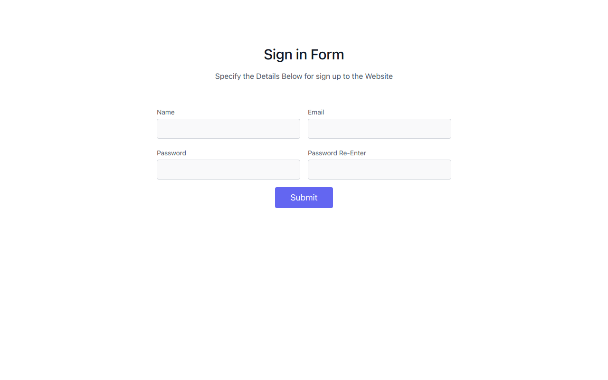

# Form Validator Webapp  

### It has mainly three input fields:
    1. Email
        - If email is not validated then it    will pop a alert
    2. Name
        - if name is not long then 2 and has special characters then it will show alert
    3. Password
        - It should be in letters, numbers and special characters  
## **[live link](https://form-validator-app-js.vercel.app)**   
  

